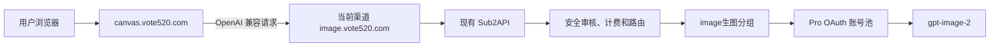

# Vote 无限画布生图工作台设计方案

## 1. 当前决策

- Canvas 直接使用 Infinite Canvas 原生渠道和 OpenAI 兼容请求流程。
- 不在 Canvas 中维护 Sub2API 专用异步任务、轮询、队列恢复或域名判断逻辑。
- `image.vote520.com` 与 `gpt-image-2` 是当前生产渠道配置，不是代码中的唯一域名或唯一模型。
- 保留原生多渠道、模型选择、画质、尺寸、批量、图像编辑、视频、音频、文本、Agent 和插件能力。
- 后续接入 Nano Banana、Grok 或其他生图服务时，优先增加渠道和模型配置，不修改 Canvas 主生成流程。

该决策取代此前文档中“固定 Vote 生图线路、固定 `quality=low`、Canvas 异步任务轮询和隐藏原生入口”的设计。

## 2. 建设目标

建设一个独立的网页创作工作台，同时复用 Sub2API 的鉴权、余额、计费、分组、账号调度、安全审核和故障切换能力。

当前生产首版只实际配置 Pro 账号池的 `gpt-image-2`，但前端架构不以此限制未来渠道。未配置的模型不会显示为可用模型。

## 3. 域名与职责

| 用途 | 地址 | 职责 |
|---|---|---|
| Sub2API 主站 | `https://ai.vote520.com` | 用户、Key、余额、计费和管理 |
| 无限画布 | `https://canvas.vote520.com` | 静态前端和浏览器本地创作数据 |
| 当前生图 API | `https://image.vote520.com` | 当前 Sub2API 生图兼容接口 |

`canvas.vote520.com` 与 `image.vote520.com` 均可通过 Cloudflare 代理。三个域名彼此独立，不修改 `ai.vote520.com` 现有解析和业务入口。

## 4. 请求架构



Canvas 使用所选渠道中的：

- `baseUrl`
- API Key
- API 协议
- 模型名称
- 画质
- 尺寸
- 数量
- 参考图和蒙版

代码不得在发起请求时把这些值覆盖成 Vote 固定值。

## 5. 标准接口

当前生图渠道至少提供：

```text
GET  /v1/models
POST /v1/images/generations
POST /v1/images/edits
```

Canvas 不依赖以下 Sub2API 扩展接口：

```text
POST /v1/images/generations/async
POST /v1/images/edits/async
GET  /v1/images/tasks/{task_id}
```

Sub2API 后端可以继续保留这些接口供其他客户端使用，但删除或修改它们不得影响 Canvas。

## 6. 渠道配置

当前生产渠道建议配置为：

```text
渠道名称：Vote Image
协议：OpenAI
接口地址：https://image.vote520.com
模型：gpt-image-2
模型能力：生图
```

用户在浏览器本地填写自己的 API Key。以后新增第三方上游时，新建另一个渠道并选择对应模型即可。

如果第三方接口并非 OpenAI 兼容格式，优先使用 Infinite Canvas 原生自定义模型调用脚本。只有多种渠道反复需要同一种新协议时，才考虑增加通用协议适配，不为单个模型写专用主流程分支。

## 7. 原生生图行为

### 7.1 文生图

调用标准 `/v1/images/generations`，传递当前模型、提示词、数量、画质、尺寸、背景等上游支持的字段。

### 7.2 图生图和多图参考

调用标准 `/v1/images/edits`，通过 multipart 表单提交提示词、参考图、蒙版和当前生成参数。

### 7.3 批量生成

沿用 Infinite Canvas 原生批量逻辑。多个结果可以并发请求并分别展示；并发是否被上游接受、排队或限流，由所选 API 服务决定。

Canvas 不实现服务端任务队列，也不保证同一 Key 的公平调度。

### 7.4 同步请求边界

采用原生同步兼容的已知代价：

- 请求必须保持到上游返回结果。
- 超过 Cloudflare、Nginx 或浏览器超时时间时可能失败。
- 用户刷新或关闭页面后，未完成请求不能恢复。
- 上游返回 `429`、`5xx` 或超时时，Canvas展示真实错误，由用户重试。
- 不通过轮询隐藏长耗时，也不额外引入任务状态数据库。

这是降低代码复杂度并保持上游兼容性的明确取舍。

## 8. 尺寸、画质与超分

Canvas 保留原生画质和尺寸控件，参数按当前渠道原样发送。

- 上游支持目标尺寸时，返回其原生结果。
- 上游忽略或拒绝尺寸时，Canvas不伪装成原生高分辨率。
- 当前方案不在 Canvas 主请求流程中自动执行 Lanczos 放大。
- 如以后需要“1K 生成后放大到 2K/4K”，应作为独立后处理工具或可信插件实现，与具体生图模型解耦。
- 后处理必须标明是重采样放大，不得宣传为模型原生 4K。

这种拆分允许同一超分工具处理 GPT、Nano Banana、Grok 或用户导入的图片，而无需修改各模型请求代码。

## 9. UI 范围

恢复并保留 Infinite Canvas 原生入口：

- 多渠道配置和模型能力标记
- 图片、视频、音频和文本工作台
- Agent 面板
- 插件管理
- 画质、尺寸、比例、数量和透明背景
- 蒙版编辑、裁剪、拆分、下载等图片工具
- 画布节点、连线、素材、提示词和项目导入导出

### 9.1 内嵌公共提示词

- 内置同源来源 `vote-123uq-image`，静态地址为 `/prompts/123uq-image.json`，不依赖 GitHub 在用户访问时可用。
- 当前包含 4 个美甲试戴场景：双手细节、面部与单手、半身双手和全身展示。
- 4 张预览封面由 Vote520 独立生成并以同源 WebP 静态资产发布，仅用于提示词卡片和详情展示，不会作为用户的图生图参考图上传。
- 来源默认启用；新用户直接获得，老用户在持久化配置合并时自动补入，用户仍可自行关闭。
- 每个模板明确要求按顺序上传两张参考图，并建议使用图生图和 `9:16`；现有提示词组件只插入文本，不会自动上传参考图或修改生成参数。
- 上游仓库 `hanbaba00/123uq-image` 未声明许可证，因此不逐字复制或打包其脚本；内置内容采用独立改写，并保留固定提交来源链接供审阅。

Vote 定制只保留：

- 品牌和许可证入口
- `ui_mode=embedded` 内嵌模式
- 主题和语言查询参数
- 移动端布局改进
- 生产安全头和部署配置

## 10. API Key 与浏览器安全

- API Key 保存在当前站点的浏览器本地配置中。
- API Key 只作为 `Authorization` 请求头发送到用户所选渠道。
- API Key、主站 Token、`user_id` 和来源 URL 不得通过 Canvas URL 导入。
- 配置导出和项目导出不得包含 API Key。
- 日志、错误提示和分析事件不得记录完整 Key。
- 公共设备使用后应清理站点数据。
- 用户应为生图 Key 设置合理额度和限速。

## 11. 内嵌模式

Sub2API 自定义菜单地址：

```text
https://canvas.vote520.com/?ui_mode=embedded
```

允许传递：

- `ui_mode=embedded`
- `theme=light|dark`
- `lang=zh-CN|en-US`

禁止传递：

- API Key
- 主站登录 Token
- `user_id`
- 主页面完整 URL

独立打开 `https://canvas.vote520.com` 时显示完整原生导航；内嵌时隐藏重复顶栏。

## 12. CSP 与第三方渠道

生产环境继续使用严格 CSP：

- `default-src` 保持同源。
- `frame-ancestors` 只允许自身和 `https://ai.vote520.com`。
- 不使用宽泛的 `connect-src https:`。
- 对象存储只放行经过校验的单一 HTTPS Origin。
- 原生插件和自定义模型脚本入口可以显示，但生产严格 CSP 不为其开放 `blob:` 或 `unsafe-eval`；本版本生产环境不承诺这些动态代码入口可运行。
- 本地 Agent 默认连接 loopback 服务，生产 CSP 不放行该地址；本版本生产环境不承诺 Agent 连接可用。

新增第三方 API 渠道时，需要在部署配置中把其精确 Origin 加入 `connect-src`。这是配置变更，不是 Canvas 业务代码变更。未经允许的任意外部域名仍应被浏览器阻止，避免本地 API Key 被不可信代码读取或外传。

## 13. 对象存储

Cloudflare R2 私有桶可以继续由 Sub2API 服务端使用，但原生 Canvas 不直接持有 R2 凭据，也不依赖 R2 才能发起请求。

- R2 凭据只进入 Sub2API 服务端环境。
- 桶保持私有。
- 返回浏览器的对象使用短期签名 URL。
- 生命周期按生产策略清理临时对象。
- Canvas 将成功结果写入浏览器 IndexedDB，签名 URL 过期后仍可读取本地副本。

## 14. 计费、审核与账号池

这些能力归 Sub2API 服务端负责，Canvas 不复制实现：

- API Key 鉴权
- 用户余额校验
- 分组和模型权限
- 内容安全审核
- Pro 账号调度和故障切换
- 请求计费与使用记录
- 并发和限流

当前 `image生图` 分组可以只开放 `gpt-image-2`，但这是生产分组策略，不是 Canvas 前端限制。

## 15. 本地验证矩阵

### 15.1 渠道与模型

- 新建、编辑、删除多个渠道。
- 每个渠道能够保存不同地址、Key、协议和模型。
- 图片、视频、音频和文本默认模型可独立选择。
- 修改渠道后请求使用当前值，不被 Vote 配置覆盖。
- 配置导出不含 API Key，导入后保留其他设置。

### 15.2 图片请求

- 文生图、单图编辑、多图参考和蒙版编辑。
- `auto`、`low`、`medium`、`high` 由上游决定是否支持。
- 比例和自定义尺寸由上游决定是否支持。
- 1、2、3、10 张批量生成。
- 上游 `400`、`401`、`403`、`429`、`5xx` 和超时错误可见。
- 不出现 `/images/*/async` 或 `/images/tasks/*` 请求。

### 15.3 原生功能

- 视频和音频入口可见，并在配置相应能力模型后调用对应渠道。
- Agent 入口保持可见；生产 CSP 不放行本机 loopback 地址，本版本不把 Agent 连接列为生产可用项。
- 插件和自定义模型脚本入口保持可见；生产 CSP 不开放 `blob:` 或 `unsafe-eval`，本版本不把动态代码执行列为生产可用项。
- 图片蒙版、裁剪、拆分和下载可用。
- 桌面和移动端无关键控件重叠。
- 内嵌模式隐藏重复导航，独立模式显示完整导航。

### 15.4 内嵌提示词

- `/prompts/123uq-image.json` 返回合法 JSON 和 4 个唯一模板。
- 新浏览器和已有持久化配置的浏览器均显示 `123UQ Image 场景模板`来源。
- 关闭该来源后保持关闭；版本升级不得删除用户自建来源。
- 从提示词列表选择模板后只填充提示词文本，并显示两张参考图的顺序要求。

### 15.5 安全

- URL 中的 Key、Token、`user_id` 和来源 URL 被移除且不写入配置。
- 配置和项目导出不含 API Key。
- CSP 只允许明确配置的 API 与对象存储 Origin。
- 非允许来源不能嵌入 Canvas。
- `ai.vote520.com` 现有网页和 API 不受部署影响。

## 16. 部署顺序

1. 在本地执行类型检查、生产构建和安全守卫。
2. 启动独立候选容器，不复用生产数据库或修改生产域名。
3. 用测试 Key 验证标准 `/v1/images/generations` 和 `/v1/images/edits`。
4. 验证原生多渠道和所有恢复入口。
5. 构建固定提交的生产镜像。
6. 仅替换 `canvas.vote520.com` 对应容器。
7. 不修改 `ai.vote520.com` DNS、证书、Nginx 路由和现有 Sub2API 容器。
8. 灰度用户确认后再扩大入口可见范围。

## 17. 回滚

发生问题时只回滚 Canvas 静态容器到上一镜像：

- 不回滚 PostgreSQL 或 Redis。
- 不修改用户余额和计费数据。
- 不改 `ai.vote520.com`。
- 不删除 R2 对象。
- `image.vote520.com` 和 Sub2API 原有接口继续工作。

## 18. 仓库维护

- Canvas 仓库：`bupiter/infinite-canvas`
- Sub2API 仓库：`zhoucheng0508/sub2api`
- `upstream` 指向原始 Infinite Canvas 仓库。
- 自定义代码只保留品牌、部署、安全与必要的通用能力。
- 同步上游时先在独立分支构建和验证，不直接部署漂移的 `latest` 镜像。
- 源码、Docker 构建上下文和文档只存放在 D 盘。
