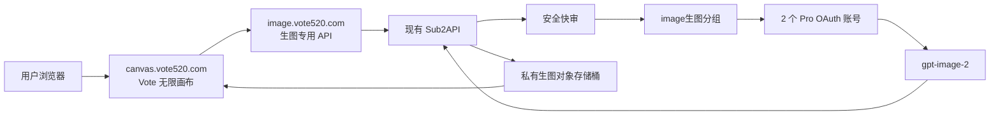

# Vote 无限画布独立生图工作台设计方案

## 1. 文档状态

- 状态：已审阅，产品与架构决策已确认
- 首版模型：`gpt-image-2`
- 前端项目：Infinite Canvas 轻量二开
- 前端仓库：`bupiter/infinite-canvas`
- Sub2API 仓库：`zhoucheng0508/sub2api`
- Sub2API 分组：`image生图`
- 首版账号池：当前分组中的 2 个 Pro OAuth 账号

## 2. 建设目标

建设一个与 Sub2API 主站相互独立、但复用其鉴权、余额、计费、分组、账号调度、安全审核和故障切换能力的网页生图工作台。

首版只接通当前 Pro 账号池的 `gpt-image-2`，不同时接入 Nano Banana、Grok 或其他生图模型。架构需要保留未来扩展能力，但首版不得为未确认的上游提前增加复杂分支。

## 3. 已确认域名

| 用途 | 地址 |
|---|---|
| Sub2API 主站 | `https://ai.vote520.com` |
| Vote 无限画布 | `https://canvas.vote520.com` |
| 生图专用 API | `https://image.vote520.com` |

两个新子域名均通过 Cloudflare 代理。`canvas.vote520.com`用于提供静态前端，`image.vote520.com`只提供生图相关 API，不提供文本推理和管理接口。

## 4. 总体架构



不额外复制一套 Sub2API、PostgreSQL 或 Redis。生图工作台与主站共享现有 Sub2API 后端和生产数据，通过独立域名、专用 API Key、专用分组和入口白名单完成逻辑隔离。

## 5. 主站入口

在 Sub2API 后台的“自定义菜单”中增加：

```text
名称：无限画布
地址：https://canvas.vote520.com
可见范围：灰度期仅管理员；正式开放后改为所有用户
显示方式：主站 iframe 内嵌，并保留“新窗口打开”
```

用户可通过两种方式使用：

1. 点击 `ai.vote520.com`侧边栏“无限画布”，在主站内嵌显示。
2. 点击“新窗口打开”，进入完整的`canvas.vote520.com`工作台。

### 5.1 主站 Token 隔离

当前 Sub2API 的自定义页面会把`user_id`和主站登录 Token 加入 iframe URL。首版采用用户手动填写生图 API Key，不需要主站登录 Token。继续透传会使 Token 进入 URL、浏览器历史、代理日志或监控系统，因此必须修改。

Sub2API 自定义菜单增加“传递用户上下文”开关：

- `canvas.vote520.com`对应菜单必须关闭该开关。
- 关闭时不得传递`user_id`、登录 Token 和主页面完整 URL。
- 可以继续传递`theme`、`lang`、`ui_mode=embedded`和来源域名。
- 新建菜单项默认关闭用户上下文透传。
- 为避免破坏已有自定义页面，旧记录字段缺失时保持原行为；管理员保存后必须明确选择。

必须增加守卫测试，确认无限画布 URL 和日志中不存在主站登录 Token。

## 6. 生图 API 入口

`image.vote520.com`作为正式公开的生图专用 API 地址，开放以下路径：

```text
GET  /v1/models
GET  /v1/sub2api/billing
POST /v1/images/generations
POST /v1/images/edits
POST /v1/images/generations/async
POST /v1/images/edits/async
GET  /v1/images/tasks/{task_id}
```

其中：

- Infinite Canvas固定使用异步接口。
- 同步接口用于兼容其他OpenAI Images API客户端。
- `/v1/models`只用于返回该生图分组允许的模型，并确认`gpt-image-2`可用。
- `/v1/sub2api/billing`用于无费用地验证Key鉴权并显示当前倍率，不返回敏感账户信息。
- Canvas连接检查必须同时验证鉴权成功且模型列表包含`gpt-image-2`，不得仅凭倍率接口判断Key属于生图分组。
- 未列出的路径全部返回`404`或`403`。
- 明确禁止`/v1/chat/completions`、`/v1/responses`、管理接口、用户接口和运维接口。

浏览器 CORS 只允许`https://canvas.vote520.com`，允许`Authorization`、`Content-Type`、请求ID等必要请求头。CORS不是服务端鉴权，非浏览器客户端仍必须通过 API Key、分组、余额、审核和并发校验。

## 7. API Key 与分组

用户需要在 Sub2API 创建单独的生图 API Key，并绑定`image生图`分组。

调用关系：

```text
生图专用 API Key
  -> image生图分组
  -> 分组中的 Pro OAuth 账号
  -> gpt-image-2
```

要求：

- 不使用绑定“混合”或其他文本分组的通用 Key。
- `image生图`分组继续保持公开，使普通用户可以创建绑定该分组的 Key。
- 分组只允许`gpt-image-2`。
- 账号模型白名单只保留`gpt-image-2`，关闭未匹配模型透传。
- 关闭`fallback_group_id`。
- 关闭无效请求回退分组。
- 两个 Pro 账号都不可用时直接返回账号池繁忙，不得回退到混合、Plus或其他Pro分组。

## 8. 异步任务与对象存储

### 8.1 主路径

Infinite Canvas不得使用同步长连接作为正式路径。流程固定为：

```text
提交异步任务
  -> 返回 202 和 task_id
  -> 每 3 秒轮询任务
  -> 完成后读取 data[].url
  -> 下载图片到浏览器 IndexedDB
  -> 在画布显示
```

使用现有 Sub2API 接口：

```text
POST /v1/images/generations/async
POST /v1/images/edits/async
GET  /v1/images/tasks/{task_id}
```

### 8.2 独立私有存储桶

使用与数据库备份相同的 S3/R2 账户，但为生图新建独立私有桶，例如：

```text
sub2api-images
```

要求：

- 不与数据库备份共用存储桶。
- 不配置永久公开`public_base_url`。
- 使用24小时有效的签名URL。
- 对象生命周期设为2天自动删除。
- CORS只允许`https://canvas.vote520.com`执行`GET`和必要的`HEAD`。
- 对象存储凭证仅保存在Sub2API服务端，不进入前端。
- Redis只保存任务状态和短URL，不保存大段图片Base64。
- 对象上传失败时任务标记为失败，不把Base64回退写入Redis。

建议配置基线：

```yaml
image_storage:
  enabled: true
  endpoint: "<S3-compatible endpoint>"
  region: "auto"
  bucket: "sub2api-images"
  access_key_id: "<secret>"
  secret_access_key: "<secret>"
  prefix: "images/"
  force_path_style: false
  public_base_url: ""
  presign_expiry_hours: 24
  max_download_bytes: 33554432
```

### 8.3 页面关闭与恢复

- 提交成功后立即把`task_id`、Key标识、提交时间和任务类型保存到浏览器。
- 页面刷新、关闭后重开或从内嵌模式切换到新窗口时恢复轮询。
- 任务完成后将图片下载到 IndexedDB，再清理活动任务记录。
- 任务查询必须使用提交任务时的同一个 API Key。
- 首版不提供“取消生成”按钮，因为当前上游不能保证取消后停止处理和计费。
- 页面应明确提示：关闭页面不代表任务被取消。

## 9. 首版功能范围

### 9.1 开放功能

- 文生图。
- 普通图生图。
- 多图参考生成。
- 无限画布节点组织和连接。
- 本地裁剪、旋转、拆分、下载。
- 保存到本地素材库。
- 画布项目导入和导出。
- 生成结果真实尺寸、耗时和状态显示。

### 9.2 暂不开放

- 局部蒙版编辑，待Pro OAuth真实验证`mask`参数后开放。
- Nano Banana。
- Grok生图。
- 视频和音频生成。
- 云端图库和跨设备同步。
- 原生2K/4K承诺。
- low、medium、high商品档位。
- 批量生图。
- 用户侧任务取消。

## 10. 参数设计

当前Pro OAuth真实测试已确认：

- `quality=low/medium/high`会被上游归一为`auto`。
- 请求精确尺寸不保证按原值输出。
- 当前不能承诺原生2K或4K。

首版UI固定为：

```text
模型：gpt-image-2
画质：自动
单次张数：1
```

可提供“正方形、横向、竖向”构图意向，但必须说明它是构图偏好，实际尺寸以上游响应为准。生成后显示图片真实宽高，不把请求尺寸显示为实际尺寸。

## 11. 安全审核

正式用户提交的文生图和图生图提示词必须经过现有内容安全审核。

策略：

- 只审核当前提示词和必要的文本字段。
- 不把参考图片Base64发送给DeepSeek。
- 不发送完整画布和无关历史。
- 默认使用快审。
- 快审结果不确定时才升级完整审核。
- 相同或高度重复提示词复用审核缓存。
- 管理员渠道状态测试请求继续排除。
- 审核通过后在异步后台执行阶段不得重复审核。

故障策略：

- 快审端点之间先执行故障切换。
- 所有审核端点都不可用时失败关闭。
- 不创建生图任务，不调用Pro账号，不扣生图费用。
- 返回“安全检查服务暂时不可用，请稍后重试”。
- 审核系统异常不得标记成用户违规，不得触发用户封禁或风控邮件。

## 12. 并发与公平性

### 12.1 容量目标

目标容量为单账号10个生图并发，两个账号总并发20，但不得未经压测直接启用。

逐级验证：

| 阶段 | 单账号并发 | 总并发 |
|---|---:|---:|
| 基线 | 1 | 2 |
| 第一轮 | 2 | 4 |
| 第二轮 | 4 | 8 |
| 第三轮 | 6 | 12 |
| 目标轮 | 10 | 20 |

每档至少连续运行3批，只启用最后一个满足全部指标的档位：

- 成功率不低于98%。
- `429`与`5xx`合计不高于2%。
- 无账号自动禁用或明显异常。
- P95总耗时不超过低并发基线的2倍。
- 无重复扣费、漏记账或失败不退款。
- Redis、对象存储和服务器内存无异常峰值。

### 12.2 每Key活动任务限制

当前Sub2API只有进程级全局图片并发限制，没有异步任务维度的每Key公平性守卫。必须增加：

- 每个生图API Key同时最多1个活动任务。
- 使用Redis原子占位，禁止先查询再写入造成并发竞争。
- 占位在任务成功、失败或创建失败时释放。
- 占位设置略大于任务最大执行时间的TTL，进程异常退出后能够自动恢复。
- 超限返回`429`和明确的`Retry-After`。
- 轮询任务不占用生成并发。

全局并发配置按压测结果设置。灰度初始值可以低于20，最终值不得超过已通过的档位。

## 13. 计费

- 保持`image生图`分组当前计费规则不变。
- 保持当前`1x`倍率。
- 首版一次请求固定生成一张图片。
- 不新增低、中、高画质或4K价格档位。
- 不在本次接入中重新设计价格。
- 上线验收必须用一张已知请求核对改造前后的扣费结果完全一致。
- 审核拒绝、审核异常、任务创建失败和未调用上游的请求不得扣生图费用。
- 上游失败、对象存储上传失败和部分结果场景必须进行专项结算测试。

说明：`1x`是分组倍率；底层是固定按图还是按图片输出Token计算，以当前生产价格配置和使用记录为准，本次改造不得擅自改变。

## 14. Infinite Canvas 二开范围

采用“薄Fork”，保留原项目核心画布，不重写节点系统。

必须修改：

1. 新增Sub2API异步图片适配器。
2. 新增任务轮询、错误归一化和页面重开恢复。
3. 默认API地址设为`https://image.vote520.com`。
4. 默认模型固定为`gpt-image-2`。
5. 首版隐藏其他供应商、视频、音频和无效参数入口。
6. 固定单次生成一张。
7. 增加`ui_mode=embedded`内嵌模式。
8. 支持从查询参数读取主题和语言，但不得读取主站Token。
9. 禁用第三方插件安装和远程脚本加载。
10. 增加活动任务本地持久化。
11. 确保项目导出不包含API Key。
12. 增加一键清除Key和本地数据。
13. 增加首次使用数据说明。
14. 设置`noindex`。
15. 增加Vote品牌和许可证入口。

保留原项目能力：

- 无限画布核心。
- 节点和连线。
- 本地素材库。
- 图片本地持久化。
- 项目导入导出。
- 裁剪、旋转、拆分和下载等本地工具。

## 15. API Key 本地安全

首版由用户手动填写绑定`image生图`分组的专用API Key。

- 默认记住在当前设备。
- 仅保存在`canvas.vote520.com`浏览器存储中。
- 页面只显示掩码，不回显完整Key。
- 导出项目、诊断日志和错误上报不得包含Key。
- Key只发送到`https://image.vote520.com`。
- 禁用第三方插件和不可信远程脚本。
- 提供一键清除Key和本地数据。
- 建议用户为生图Key设置额度或限速。
- 公共设备使用后应清除本地数据。

## 16. 本地数据与隐私说明

首版不做Sub2API云端图库或跨设备同步。

- 画布、图片、提示词记录和素材保存在当前浏览器IndexedDB。
- 清除浏览器数据、使用无痕模式或更换设备后不能保证恢复。
- 提供项目手动导出和导入。
- 对象存储中的服务端临时图片最多保留2天，不作为用户云端备份。

首次填写Key前展示一次确认：

- 提示词会发送给安全审核服务和生图上游。
- 生成图片会在私有对象存储临时保留最多2天。
- 画布和Key主要保存在当前浏览器。
- 清除浏览器数据可能导致历史无法恢复。
- 成功生成按现有规则扣费。
- 关闭页面不会取消已经提交的任务。
- 禁止提交违法或明显滥用内容。

## 17. 浏览器与边缘安全

### 17.1 canvas.vote520.com

- Cloudflare代理开启。
- 静态指纹资源可长期缓存，HTML不得长期缓存。
- `robots`和页面元信息设置`noindex`。
- CSP只允许本站脚本和必要资源。
- `frame-ancestors`只允许`https://ai.vote520.com`和自身。
- 禁止任意第三方脚本、插件和不受控图片域名。

### 17.2 image.vote520.com

- Cloudflare代理开启。
- 所有API响应禁止CDN缓存。
- Nginx和Cloudflare请求体上限按100MB控制。
- 代理读取和发送超时按生图需求设置。
- CORS只允许`https://canvas.vote520.com`。
- 服务端仍必须校验API Key，不能把CORS当作鉴权。
- 日志必须脱敏`Authorization`和签名URL查询参数。
- 同步接口执行超过100秒时做Cloudflare `524`专项测试。
- 可靠主路径始终为异步接口，不为兼容同步接口关闭Cloudflare或暴露源站。

## 18. 品牌与许可证

- 产品名称：`Vote 无限画布`。
- 浏览器标题使用`Vote 无限画布`。
- 使用现有Vote Logo和品牌资产。
- 内嵌模式直接进入工作台，减少重复导航。
- 新窗口模式保留完整工具导航。
- 保留Infinite Canvas原项目MIT许可证。
- 在“关于”中保留上游项目名称和GitHub链接。

## 19. 仓库与上游同步

### 19.1 仓库

```text
bupiter/infinite-canvas
```

原因：`zhoucheng0508`是个人GitHub账号，`bupiter`对`zhoucheng0508/sub2api`的协作权限不等于可以在其个人命名空间创建新仓库。

### 19.2 维护方式

- `origin`指向`bupiter/infinite-canvas`。
- `upstream`指向`basketikun/infinite-canvas`。
- 固定首版上游提交或标签，不跟随`latest`漂移。
- 自定义修改按适配层、安全层、品牌层拆分，避免侵入画布核心。
- 每次同步上游先在独立分支完成rebase或merge、构建和数据兼容测试。
- 上游README已提示历史数据格式可能变化，升级必须验证旧画布导入和IndexedDB恢复。

实施前需要重新登录本机GitHub CLI；当前保存的`bupiter`令牌已失效并返回`401`。

## 20. 实施拆分

### PR A：Sub2API 安全与公平性守卫

- 自定义菜单增加“传递用户上下文”开关。
- 无限画布菜单关闭Token和用户信息透传。
- 增加每API Key一个活动生图任务的Redis原子守卫。
- 增加相关单元测试和路由守卫测试。
- 确认`image生图`分组无跨组回退。

### PR B：Infinite Canvas 生图适配

- 创建`bupiter/infinite-canvas`。
- 增加异步提交、轮询、恢复和结果下载。
- 固定API入口和模型。
- 实现文生图、普通图生图和多图参考。
- 精简参数和无关供应商入口。

### PR C：Infinite Canvas 安全、内嵌与品牌

- API Key安全处理。
- 禁用第三方插件和不可信远程脚本。
- 内嵌模式、主题、语言。
- Vote品牌、首次使用说明、noindex和许可证页面。

### 部署配置

- 创建`canvas.vote520.com`和`image.vote520.com`DNS记录。
- 配置Cloudflare代理、TLS、缓存和WAF。
- 部署Canvas静态容器或静态文件服务。
- 配置image域名Nginx路由白名单。
- 创建并配置私有生图对象存储桶。
- 配置对象生命周期和CORS。
- 在Sub2API中启用异步图片存储。
- 配置并压测图片并发。

## 21. 测试矩阵

### 21.1 功能

| 场景 | 验收标准 |
|---|---|
| 文生图 | 返回一张图片并进入画布 |
| 中文文字 | 能生成并下载，记录实际效果 |
| 普通图生图 | 参考图成功上传并返回新图 |
| 多图参考 | 多张参考图正确提交，不串图 |
| 构图方向 | 显示为偏好，实际尺寸按响应记录 |
| 项目导出导入 | 图片和节点可恢复，Key不进入导出包 |
| 页面关闭恢复 | 重开后自动恢复轮询和结果 |
| 内嵌/新窗口 | 两种模式共享同一Canvas本地数据和Key |

### 21.2 路由与隔离

| 场景 | 验收标准 |
|---|---|
| 生图Key | 只命中`image生图`分组 |
| 普通混合Key | 连接检查提示无生图权限或模型不可用 |
| 两个Pro账号故障 | 直接失败，不跨组回退 |
| 文本接口 | `image.vote520.com`返回404或403 |
| 管理接口 | `image.vote520.com`不可访问 |
| 模型限制 | 除`gpt-image-2`外均不可调度 |

### 21.3 安全审核

| 场景 | 验收标准 |
|---|---|
| 正常提示词 | 快审通过后只审核一次 |
| 高风险提示词 | 创建任务前阻断，不调用Pro账号 |
| 不确定提示词 | 按规则升级完整审核 |
| 参考图片 | Base64不进入审核请求和日志 |
| 审核端点全故障 | 失败关闭，不扣生图费，不标记用户违规 |
| 管理员渠道测试 | 不产生无效安全审计 |

### 21.4 计费与任务

| 场景 | 验收标准 |
|---|---|
| 成功任务 | 只扣一次，倍率与当前生产一致 |
| 审核拒绝 | 不扣生图费用 |
| 上游失败 | 按现有规则正确退款或不扣费 |
| 对象上传失败 | 任务失败，Redis不保存Base64 |
| 使用其他Key轮询 | 返回404，不泄露任务存在性 |
| 重复轮询 | 不重复扣费或重复上传对象 |

### 21.5 并发与稳定性

- 按2、4、8、12、20总并发逐级压测。
- 每档至少3批。
- 记录成功率、429/5xx、P50/P95、账号状态、内存、对象上传和计费。
- 验证同一个Key第二个活动任务返回429。
- 验证不同Key能够公平占用并发。
- 验证等待、超时和任务终态不会永久占用Key。

### 21.6 浏览器与安全

- API Key不出现在URL、导出包、诊断日志和错误上报中。
- 主站登录Token不进入Canvas URL和Nginx日志。
- Canvas不能调用非`image.vote520.com`的AI接口。
- 非允许Origin的浏览器请求被CORS拒绝。
- 签名URL过期后，本地IndexedDB图片仍可读取。
- 清理本地数据后Key和图片均删除。
- 桌面和移动端无关键控件重叠。

## 22. 灰度上线

不做长时间本地试运行，但必须完成构建、单元测试和最小接口守卫测试。

### 阶段1：快速发布前检查

- 构建Infinite Canvas生产镜像或静态产物。
- 执行Sub2API新增守卫测试。
- 执行Canvas异步任务和Key安全测试。
- 使用测试Key完成最小端到端请求。

### 阶段2：管理员与测试用户联合生产灰度

- 同时开放管理员和3至5名测试用户。
- 测试用户可直接访问`canvas.vote520.com`。
- 主站“无限画布”菜单暂时仅管理员可见。
- 收集至少100张真实生成数据。
- 并发按压测通过的档位启用。

### 阶段3：正式开放

满足以下条件后，把主站菜单改为所有用户可见：

- 真实生成不少于100张。
- 成功率、错误率和P95满足并发验收线。
- 无错误扣费和跨组调度。
- 无Token泄露。
- 无Pro账号明显异常。
- 对象存储和任务恢复稳定。

## 23. 回滚与停用

必须能够独立停用生图工作台，而不影响Sub2API文本业务：

1. 隐藏主站“无限画布”菜单。
2. 在Cloudflare或Nginx关闭`image.vote520.com`新任务提交。
3. 关闭Sub2API异步图片任务开关。
4. 已提交任务仍允许通过原Key查询终态。
5. `canvas.vote520.com`可切换为维护提示页。
6. 不删除数据库、Redis任务或对象存储中的在途结果。
7. 保留前一版Canvas镜像或静态产物以便回滚。

## 24. 首版验收定义

满足以下条件才视为首版完成：

- 用户能在主站内嵌或新窗口打开Vote无限画布。
- 用户填写绑定`image生图`分组的Key后可生成图片。
- 文生图、普通图生图和多图参考可用。
- Infinite Canvas使用异步接口并支持页面重开恢复。
- 生图只使用两个指定Pro账号，不跨组回退。
- 审核只执行一次，审核故障失败关闭。
- 对象存储私有、临时、可自动清理。
- API Key和主站Token不泄露。
- 计费与改造前保持一致。
- 并发生产值经过压测验证。
- 回滚不会影响现有Sub2API主站和文本接口。
